# 개발 워크스테이션 구축 미션

## 1. 프로젝트 개요
터미널, Docker, Git을 활용하여 어디서나 재현 가능한 개발 환경을 구축하고, 컨테이너 기반의 웹 서버 운영 및 데이터 영속성을 검증하는 프로젝트입니다.

---

## 2. 실행 환경
* **OS:** Windows 10/11 (Git Bash / MINGW64)
* **Docker:** OrbStack (또는 Docker Desktop)
* **Git 버전:** [git version 2.47.1.windows.2]
* **터미널:** Git Bash (MINGW64)

---

## 3. 수행 항목 체크리스트
- [x] 터미널 기본 조작 및 파일 관리
- [x] 파일 및 디렉토리 권한 설정 (chmod)
- [x] Docker 설치 및 기본 환경 점검
- [x] 커스텀 Dockerfile 기반 이미지 빌드
- [x] 포트 매핑을 통한 웹 서버 접속
- [x] Docker 볼륨을 이용한 데이터 영속성 검증
- [x] Git 사용자 설정 및 GitHub 저장소 연동

---

## 4. 수행 기록 및 검증

### 4.1 Git 설정 확인
사용자 정보 및 기본 브랜치 설정을 완료하였습니다.

```bash
$ git config --list
user.name=heeyoung35
user.email=kheeyoung35@gmail.com
core.autocrlf=true
init.defaultbranch=master
safe.directory=D:/codyssey/codysseyworkstation-mission

remote.origin.url=https://github.com/heeyoung35/codysseyworkstation-mission.git
branch.main.remote=origin
branch.main.merge=refs/heads/main
user.name=heeyoung35
user.email=kheeyoung35@gmail.com
```

**GitHub 원격 저장소 연동 및 최신 커밋 확인:**
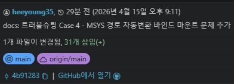

### 4.2 터미널 조작 및 권한 실습 (로컬 환경)
터미널을 이용한 디렉토리 제어 및 파일 생성 로그입니다. 윈도우 환경의 특성상 `chmod` 명령어가 기호로 출력되지 않는 현상을 확인하였습니다.

```bash
$ pwd
/d/codyssey/codysseyworkstation-mission

$ mkdir mission_logs

$ cd mission_logs

$ touch test.txt

$ ls -l test.txt
-rw-r--r-- 1 gram 197121 0 Mar 31 17:28 test.txt

$ chmod 755 test.txt$ ls -l test.txt
-rw-r--r-- 1 gram 197121 0 Mar 31 17:28 test.txt  # 윈도우 환경상 변화 없음
```

**파일(test.txt) 권한 변경 전/후 확인:**
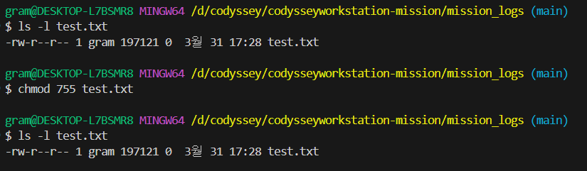

**디렉토리(mission_logs) 권한 변경 전/후 확인:**
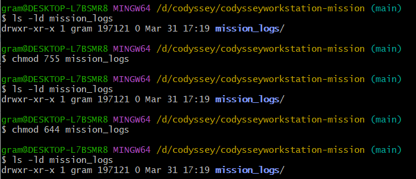

### 4.3 Docker 설치 및 기본 환경 점검
Docker 엔진의 정상 작동 여부를 `docker info`와 `hello-world` 실행으로 검증하였습니다.

**Docker 주요 정보:**
* **Server Version:** 28.1.1
* **Operating System:** Docker Desktop
* **Kernel Version:** 6.6.87.1-microsoft-standard-WSL2

**docker --version 확인:**
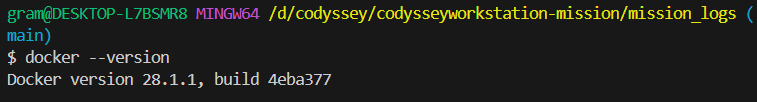

**docker info 상세 출력:**
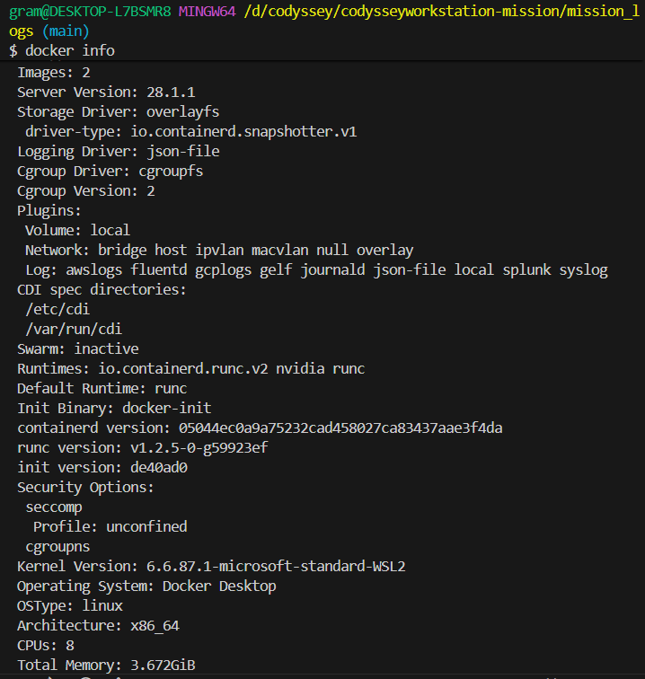

```bash
$ docker run hello-world
Hello from Docker!
This message shows that your installation appears to be working correctly.
```

**hello-world 실행 전체 로그:**
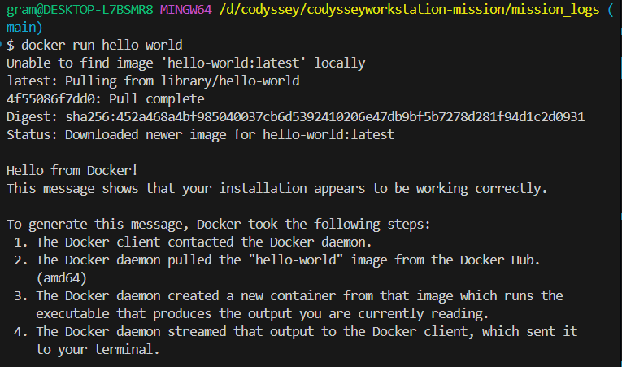

### 4.3-1 Docker 운영 명령 실행 기록
Docker 엔진 상태를 점검하는 주요 운영 명령어를 실행하고 결과를 기록하였습니다.

**docker images (로컬 이미지 목록):**
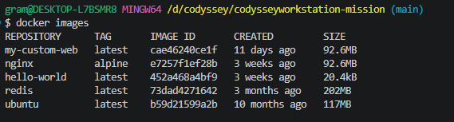

**docker ps -a (전체 컨테이너 목록):**
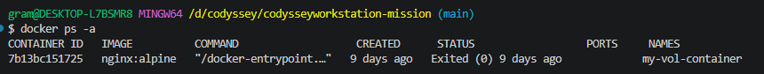

**docker logs (컨테이너 실행 로그):**
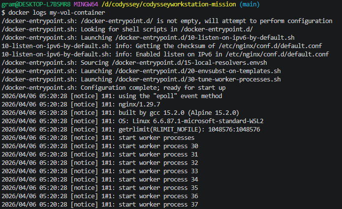

**docker stats --no-stream (리소스 사용량):**
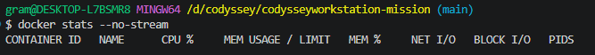

### 4.4 Docker 컨테이너 내 권한 실습
로컬(Windows) 환경에서 확인이 불가능했던 `chmod` 동작을 Ubuntu 컨테이너 내부(Linux 환경)에서 성공적으로 재검증하였습니다.

```bash
# Ubuntu 컨테이너 실행 및 권한 변경 테스트
$ docker run -it ubuntu
root@2f9e1e7f2886:/# touch docker_test.txt
root@2f9e1e7f2886:/# chmod 755 docker_test.txt
root@2f9e1e7f2886:/# ls -l docker_test.txt
-rwxr-xr-x 1 root root 0 Mar 31 09:43 docker_test.txt # 실행 권한(x) 확인
```

**Ubuntu 컨테이너 내부 chmod 성공 확인:**
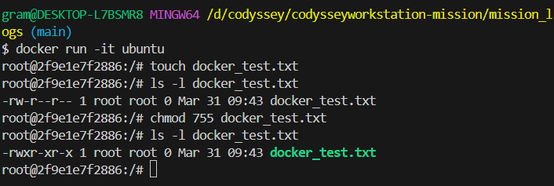

### 4.5 커스텀 Dockerfile 빌드 및 실행
사용자 정의 HTML 파일을 포함하는 커스텀 이미지를 빌드하고, 포트 매핑(8080:80)을 통해 호스트 브라우저에서 접속을 확인하였습니다.

#### Dockerfile
```dockerfile
FROM nginx:alpine
COPY index.html /usr/share/nginx/html/index.html
EXPOSE 80
CMD ["nginx", "-g", "daemon off;"]
```

#### 빌드 및 실행 명령어
```bash
# 1. 빌드 명령어
$ docker build -t my-nginx:1.0 .

# 2. 실행 명령어
$ docker run -d -p 8080:80 my-nginx:1.0

# 3. 접속 확인
$ curl http://localhost:8080
```

#### 접속 증명


### 4.5-1 바인드 마운트(Bind Mount) 실습
호스트 디렉토리를 컨테이너에 직접 연결하여, **컨테이너를 재빌드하지 않고도 호스트 파일 변경이 즉시 반영**되는 것을 검증하였습니다.

```bash
# 바인드 마운트로 nginx 컨테이너 실행
# (MSYS_NO_PATHCONV=1: Git Bash 경로 자동변환 방지)
MSYS_NO_PATHCONV=1 docker run -d -p 8081:80 --name bind-test \
  -v /c/Users/gram/codyssey/bind-test:/usr/share/nginx/html \
  nginx:alpine

# 변경 전 파일 설정
echo '<h1>Before Change</h1>' > /c/Users/gram/codyssey/bind-test/index.html
# → http://localhost:8081 접속 확인

# 호스트 파일만 수정 (컨테이너 재시작 없음)
echo '<h1>After Change!</h1>' > /c/Users/gram/codyssey/bind-test/index.html
# → 브라우저 새로고침만으로 즉시 반영 확인
```

**변경 전 (Before Change) — localhost:8081 접속:**
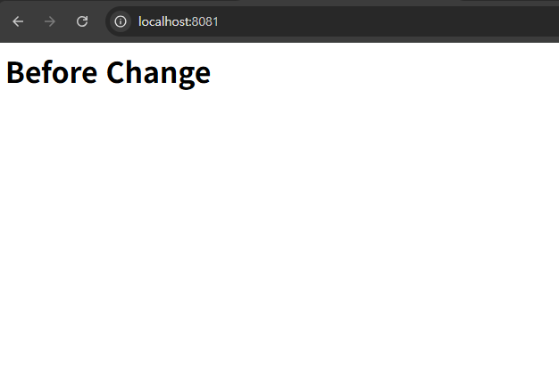

**변경 후 (After Change!) — 컨테이너 재시작 없이 즉시 반영:**
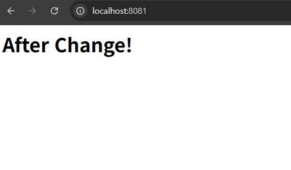

### 4.6 Docker 볼륨 영속성 검증
Docker 볼륨을 생성하여 컨테이너가 삭제된 이후에도 데이터가 보존되는 것을 검증하였습니다.


```bash
# 1. 볼륨 생성
docker volume create mydata

# 2. 첫 번째 컨테이너 실행 및 데이터 쓰기
docker run -d --name vol-test1 -v mydata:/data ubuntu sleep infinity
docker exec vol-test1 bash -c "echo 'hello volume' > /data/hello.txt && cat /data/hello.txt"

# 3. 첫 번째 컨테이너 삭제
docker rm -f vol-test1

# 4. 두 번째 컨테이너로 동일 볼륨 재연결 → 데이터 유지 확인
docker run -d --name vol-test2 -v mydata:/data ubuntu sleep infinity
docker exec vol-test2 bash -c "cat /data/hello.txt"
# → "hello volume" 출력 = 볼륨 영속성 증명 완료
```

**① 볼륨 생성 (`docker volume create mydata`):**
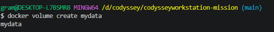

**② 첫 번째 컨테이너(vol-test1) 실행:**
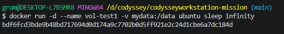

**③ 볼륨에 데이터 쓰기 및 확인 (`hello volume` 출력):**
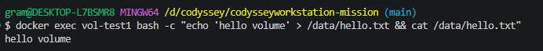

**④ vol-test1 컨테이너 삭제:**
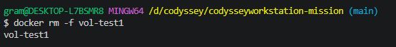

**⑤ 두 번째 컨테이너(vol-test2) 동일 볼륨으로 재연결:**
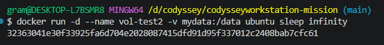

**⑥ 컨테이너 삭제 후에도 데이터 유지 확인 (영속성 증명):**
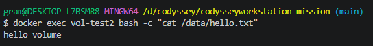

---

## 5. 트러블슈팅
### Case 1: Git 설정 시 'safe.directory' 에러
문제: 저장소 경로를 Git이 신뢰하지 않아 명령어가 거부됨.

원인: Git 보안 정책 강화로 인한 미등록 경로 차단.

해결: git config --global --add safe.directory 명령으로 경로 등록.

### Case 2: 로컬 환경(Windows)에서의 chmod 미적용
문제: chmod 실행 후에도 ls -l 기호가 변하지 않음.

원인: Windows NTFS 파일 시스템과 POSIX 권한 체계의 불일치.

해결: Docker 리눅스 컨테이너 환경을 활용하여 명령의 정상 동작을 교차 검증함.

### Case 3: Git Pull 시 머지 충돌(Merge Conflict)
문제: 원격과 로컬의 파일 내용이 달라 Automatic merge failed 발생.

원인: GitHub 초기 생성 파일과 로컬 신규 파일 간의 충돌.

해결: git merge --abort 후 수동 병합(Conflict 해결) 수행.

### Case 4: Git Bash MSYS 경로 자동변환으로 인한 바인드 마운트 실패

**문제:** Git Bash에서 `-v` 옵션으로 바인드 마운트를 설정했으나, 브라우저에서 nginx 기본 페이지(Welcome to nginx!)가 그대로 출력됨.

**원인:** Git Bash(MSYS2 환경)는 `/usr/share/nginx/html` 같은 경로를 자동으로 Windows 경로로 변환함.
`/usr` → `C:\Program Files\Git\usr` 로 변환되어 Docker에 엉뚱한 경로가 전달됨.

`docker inspect`로 확인한 실제 마운트 결과:
```bash
$ docker inspect bind-test --format='{{json .Mounts}}'
[{
  "Source": "C:\\Users\\gram\\codyssey\\bind-test;C",
  "Destination": "\\Program Files\\Git\\usr\\share\\nginx\\html"
}]
# → Destination이 컨테이너 내부 경로가 아닌 Git 설치 경로로 잘못 변환됨
```

**해결:** `MSYS_NO_PATHCONV=1` 환경변수를 앞에 붙여 경로 자동변환을 비활성화한 후 실행.

```bash
docker rm -f bind-test

MSYS_NO_PATHCONV=1 docker run -d -p 8081:80 --name bind-test \
  -v /c/Users/gram/codyssey/bind-test:/usr/share/nginx/html \
  nginx:alpine

# 내부 파일 확인으로 마운트 성공 검증
MSYS_NO_PATHCONV=1 docker exec -it bind-test ls /usr/share/nginx/html
# → index.html 출력 확인 (바인드 마운트 정상 동작)
```

