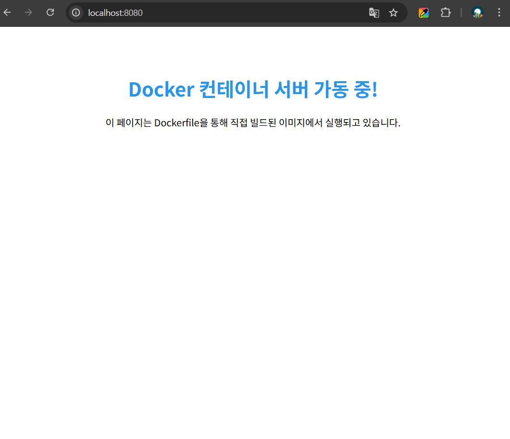

# 개발 워크스테이션 구축 미션

## 1. 프로젝트 개요
터미널, Docker, Git을 활용하여 어디서나 재현 가능한 개발 환경을 구축하고, 컨테이너 기반의 웹 서버 운영 및 데이터 영속성을 검증하는 프로젝트입니다.

---

## 2. 실행 환경
* **OS:** Windows 10/11 (Git Bash / MINGW64)
* **Docker:** OrbStack (또는 Docker Desktop)
* **Git 버전:** [git version 2.47.1.windows.2]
* **터미널:** Git Bash (MINGW64)

---

## 3. 수행 항목 체크리스트
- [x] 터미널 기본 조작 및 파일 관리
- [x] 파일 및 디렉토리 권한 설정 (chmod)
- [x] Docker 설치 및 기본 환경 점검
- [x] 커스텀 Dockerfile 기반 이미지 빌드
- [x] 포트 매핑을 통한 웹 서버 접속
- [x] Docker 볼륨을 이용한 데이터 영속성 검증
- [x] Git 사용자 설정 및 GitHub 저장소 연동

---

## 4. 수행 기록 및 검증

### 4.1 Git 설정 확인
사용자 정보 및 기본 브랜치 설정을 완료하였습니다.

```bash
$ git config --list
user.name=heeyoung35
user.email=kheeyoung35@gmail.com
core.autocrlf=true
init.defaultbranch=master
safe.directory=D:/codyssey/codysseyworkstation-mission

remote.origin.url=https://github.com/heeyoung35/codysseyworkstation-mission.git
branch.main.remote=origin
branch.main.merge=refs/heads/main
user.name=heeyoung35
user.email=kheeyoung35@gmail.com
```

### 4.2 터미널 조작 및 권한 실습 (로컬 환경)
터미널을 이용한 디렉토리 제어 및 파일 생성 로그입니다. 윈도우 환경의 특성상 `chmod` 명령어가 기호로 출력되지 않는 현상을 확인하였습니다.

```bash
$ pwd
/d/codyssey/codysseyworkstation-mission

$ mkdir mission_logs

$ cd mission_logs

$ touch test.txt

$ ls -l test.txt
-rw-r--r-- 1 gram 197121 0 Mar 31 17:28 test.txt

$ chmod 755 test.txt$ ls -l test.txt
-rw-r--r-- 1 gram 197121 0 Mar 31 17:28 test.txt  # 윈도우 환경상 변화 없음
```

### 4.3 Docker 설치 및 기본 환경 점검
Docker 엔진의 정상 작동 여부를 `docker info`와 `hello-world` 실행으로 검증하였습니다.

**Docker 주요 정보:**
* **Server Version:** 28.1.1
* **Operating System:** Docker Desktop
* **Kernel Version:** 6.6.87.1-microsoft-standard-WSL2

```bash
$ docker run hello-world
Hello from Docker!
This message shows that your installation appears to be working correctly.
```

### 4.4 Docker 컨테이너 내 권한 실습
로컬(Windows) 환경에서 확인이 불가능했던 `chmod` 동작을 Ubuntu 컨테이너 내부(Linux 환경)에서 성공적으로 재검증하였습니다.


```bash
# Ubuntu 컨테이너 실행 및 권한 변경 테스트
$ docker run -it ubuntu
root@2f9e1e7f2886:/# touch docker_test.txt
root@2f9e1e7f2886:/# chmod 755 docker_test.txt
root@2f9e1e7f2886:/# ls -l docker_test.txt
-rwxr-xr-x 1 root root 0 Mar 31 09:43 docker_test.txt # 실행 권한(x) 확인
```

### 4.5 커스텀 Dockerfile 빌드 및 실행
사용자 정의 HTML 파일을 포함하는 커스텀 이미지를 빌드하고, 포트 매핑(8080:80)을 통해 호스트 브라우저에서 접속을 확인하였습니다.

# Dockerfile
```Dockerfile
FROM nginx:alpine
COPY index.html /usr/share/nginx/html/index.html
EXPOSE 80
CMD ["nginx", "-g", "daemon off;"]

# 1. 빌드 명령어
$ docker build -t my-nginx:1.0 .

# 2. 실행 명령어
$ docker run -d -p 8080:80 my-nginx:1.0

# 3. 접속 확인
$ curl http://localhost:8080

# 4. 접속 증명


```

## 5. 트러블슈팅
### Case 1: Git 설정 시 'safe.directory' 에러
문제: 저장소 경로를 Git이 신뢰하지 않아 명령어가 거부됨.

원인: Git 보안 정책 강화로 인한 미등록 경로 차단.

해결: git config --global --add safe.directory 명령으로 경로 등록.

### Case 2: 로컬 환경(Windows)에서의 chmod 미적용
문제: chmod 실행 후에도 ls -l 기호가 변하지 않음.

원인: Windows NTFS 파일 시스템과 POSIX 권한 체계의 불일치.

해결: Docker 리눅스 컨테이너 환경을 활용하여 명령의 정상 동작을 교차 검증함.

### Case 3: Git Pull 시 머지 충돌(Merge Conflict)
문제: 원격과 로컬의 파일 내용이 달라 Automatic merge failed 발생.

원인: GitHub 초기 생성 파일과 로컬 신규 파일 간의 충돌.

해결: git merge --abort 후 수동 병합(Conflict 해결) 수행.

